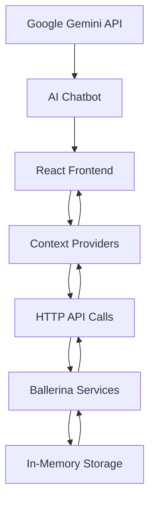

# SheCare - Women's Health & Wellness Platform

A comprehensive women's health platform built with **pure Ballerina backend microservices** and a modern Next.js frontend. Features AI-powered health insights, period tracking, wellness monitoring, and personalized care recommendations.

## ✨ Key Features

- **Smart Period Tracking** - AI-powered cycle predictions and calendar
- **Wellness Monitoring** - Mood, energy, sleep, and symptom tracking  
- **Health News** - Curated women's health articles and bookmarking
- **AI Health Assistant** - Google Gemini-powered chatbot for health queries
- **Secure Authentication** - WSO2 Asgardeo OAuth integration
- **Analytics & Insights** - Beautiful charts and wellness trends
- **Modern UI** - Responsive design with Tailwind CSS and shadcn/ui

## 🚀 Quick Start

### Prerequisites
- [Ballerina](https://ballerina.io/) (for backend services)
- [Node.js 18+](https://nodejs.org/) (for frontend)
- [Google Gemini API Key](https://aistudio.google.com/) (for AI chatbot)

### 1. Start Backend Services
```bash
# Terminal 1 - Wellness Service (Port 8082)
cd back-end/wellness-api
bal run

# Terminal 2 - News Service (Port 8060) 
cd back-end/news_service
bal run

# Terminal 3 - Period Service (Port 8081)
cd back-end/period_service  
bal run
```

### 2. Configure Environment
```bash
cd front-end
cp .env.example .env.local
# Add your Google Gemini API key to .env.local
```

### 3. Start Frontend
```bash
cd front-end
npm install
npm run dev
```

### 4. Access Application
- **Frontend**: http://localhost:3001
- **Wellness API**: http://localhost:8082
- **News API**: http://localhost:8060  
- **Period API**: http://localhost:8081

## Architecture

### Backend Services (Pure Ballerina)

Our backend consists of three independent Ballerina microservices:

1. **🏥 Wellness API** - `http://localhost:8082`
   ```bash
   GET  /api/wellness/health              # Service health check
   POST /api/wellness/entries             # Add wellness entry
   GET  /api/wellness/users/{id}/entries  # Get user wellness history
   PUT  /api/wellness/entries/{date}      # Update wellness entry
   ```

2. ** News Service** - `http://localhost:8060`  
   ```bash
   GET  /api/news/health                  # Service health check
   GET  /api/news/articles                # Get categorized health news
   POST /api/news/bookmarks               # Bookmark article
   GET  /api/news/bookmarks/{userId}      # Get user bookmarks
   ```

3. ** Period Service** - `http://localhost:8081`
   ```bash
   GET  /api/period/health                # Service health check
   POST /api/period/predict               # Generate cycle predictions
   GET  /api/period/calendar/{year}/{month} # Get calendar data
   POST /api/period/cycles                # Log period data
   ```

### Frontend Stack (Next.js 14)

- **Framework**: Next.js 14 with App Router
- **Styling**: Tailwind CSS + shadcn/ui components
- **State Management**: React Context API
- **Authentication**: WSO2 Asgardeo OAuth
- **Charts**: Recharts for wellness analytics
- **Animations**: Framer Motion
- **AI Integration**: Google Gemini API for chatbot

## Data Flow Architecture



##  Testing the APIs

Each Ballerina service provides health check endpoints for monitoring:

```bash
# Test all services
curl http://localhost:8082/api/wellness/health
curl http://localhost:8060/api/news/health  
curl http://localhost:8081/api/period/health
```

##  Core Features in Detail

###  **Period Tracking**
- **Smart Predictions**: cycle forecasting
- **Calendar View**: 90-day period tracking calendar
- **Fertility Windows**: Ovulation and fertile period calculations
- **Cycle Analytics**: Trend analysis and irregularity detection

###  **Wellness Monitoring**  
- **Mood Tracking**: Daily emotional state logging
- **Energy Levels**: Physical energy and activity monitoring
- **Sleep Quality**: Sleep duration and quality assessment
- **Symptom Correlation**: Pattern recognition across health metrics

###  **Health News**
- **Curated Content**: Women's health focused articles
- **Smart Categorization**: AI-powered content classification
- **Bookmark System**: Save articles for later reading
- **Personalized Feed**: Recommendations based on user interests

###  **AI Health Assistant**
- **24/7 Availability**: Always-on health guidance
- **Context-Aware**: Understanding of women's health topics
- **Privacy-First**: Secure conversation handling
- **Multi-lingual**: Support for various languages

### Environment Variables
```bash
# .env.local (frontend)
GEMINI_API_KEY=your_gemini_api_key
NEXT_PUBLIC_WELLNESS_API_URL=http://localhost:8082/api/wellness
NEXT_PUBLIC_NEWS_API_URL=http://localhost:8060/api/news  
NEXT_PUBLIC_PERIOD_API_URL=http://localhost:8081/api/period
```

### Docker Support (Optional)
```bash
# Build containers
docker-compose build

# Start all services
docker-compose up
```

##  Tech Stack Summary

### Backend
- **Language**: Ballerina 
- **Architecture**: Microservices
- **Storage**: In-memory (demo) / Database ready
- **API Style**: RESTful HTTP/JSON

### Frontend  
- **Framework**: Next.js 14 (React 18)
- **Language**: TypeScript
- **Styling**: Tailwind CSS
- **Components**: shadcn/ui (Radix UI)
- **State**: React Context + Custom Hooks
- **Charts**: Recharts
- **Animations**: Framer Motion
- **Auth**: WSO2 Asgardeo OAuth

### AI & External APIs
- **Chatbot**: Google Gemini Pro
- **News**: Integrated news aggregation
- **Authentication**: WSO2 Identity Server

##  Contributing

1. **Fork** the repository
2. **Create** a feature branch (`git checkout -b feature/amazing-feature`)
3. **Commit** your changes (`git commit -m 'Add amazing feature'`)
4. **Push** to the branch (`git push origin feature/amazing-feature`)
5. **Open** a Pull Request

##  Project Structure

```
SheCare/
├── back-end/
│   ├── wellness-api/         # Wellness tracking service
│   ├── news_service/         # Health news service  
│   └── period_service/       # Period tracking service
├── front-end/
│   ├── app/                  # Next.js app directory
│   ├── components/           # Reusable UI components
│   ├── contexts/             # React Context providers
│   ├── hooks/                # Custom React hooks
│   └── lib/                  # Utility functions
└── README.md                 # Project documentation
```
## 📞 Support

For questions, issues, or contributions:
- **Repository**: [SheCare GitHub](https://github.com/dinilH/SheCare)
- **Issues**: Use GitHub Issues for bug reports and feature requests
- **Discussions**: Join the GitHub Discussions for community support

---

**Built with ❤️ for the Ballerina Competition 2025**