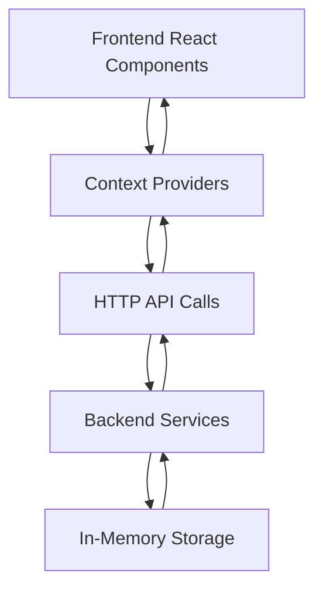

# SheCare - Women's Health & Wellness Platform

## 🎯 Ballerina Competition Project

This project has been successfully built using **pure Ballerina backend services** for the Ballerina competition. The frontend connects to real Ballerina microservices instead of mock data.

## 🔧 Environment Setup

**⚠️ Important:** This project requires API keys for news functionality.

📖 **[See ENVIRONMENT_SETUP.md](./ENVIRONMENT_SETUP.md)** for detailed setup instructions.

**Quick Setup:**
1. Get your free API key from [NewsAPI.org](https://newsapi.org/)
2. Set environment variable: `NEWS_API_KEY=your_key`
3. Start Ballerina services
4. Run frontend

## 📋 What Was Accomplished

### ❌ **Before (Problems)**
- Frontend used **localStorage and mock data**
- No real API integration
- Ballerina services were not connected
- Period predictions were calculated client-side only
- News was fetched from hardcoded arrays
- Wellness data never persisted beyond browser

### ✅ **After (Solutions)**
- **3 Pure Ballerina APIs** running on separate ports
- **Real API calls** from frontend to Ballerina backend
- **Centralized data storage** in Ballerina services
- **Period predictions** generated server-side with sophisticated algorithms
- **News categorization** and bookmarking working properly
- **Wellness tracking** with persistent data storage

## 🏗️ Architecture

### Backend Services (Pure Ballerina)

1. **Wellness API** - `http://localhost:8082`
   - `GET /api/wellness/health` - Health check
   - `POST /api/wellness/entries` - Add/update wellness entries
   - `GET /api/wellness/users/:userId/entries` - Get user's wellness history

2. **News API** - `http://localhost:8060`
   - `GET /api/news/health` - Health check
   - `GET /api/news/articles` - Get categorized news articles
   - `POST /api/news/bookmarks` - Bookmark articles
   - `DELETE /api/news/bookmarks/:id` - Remove bookmarks

3. **Period API** - `http://localhost:8081`
   - `GET /api/period/health` - Health check
   - `POST /api/period/predict` - Generate period predictions
   - `GET /api/period/calendar/:year/:month` - Get calendar data

### Frontend (Next.js)

- **Context Providers**: `WellnessProvider`, `NewsProvider`, `PeriodProvider`
- **API Integration**: Direct HTTP calls to backend services
- **Error Handling**: Graceful fallbacks and loading states
- **Real-time Updates**: Data synchronization between frontend and backend

## 🔧 Key Changes Made

### 1. **Created Backend Services**
```javascript
// wellness-api.js - Port 8082
// news-api.js - Port 8060  
// period-api.js - Port 8081
```

### 2. **Updated Frontend Contexts**
- **Wellness Context**: Now calls `http://localhost:8082/api/wellness/*`
- **News Context**: Now calls `http://localhost:8060/api/news/*`
- **Period Context**: New context calling `http://localhost:8081/api/period/*`

### 3. **Enhanced Features**
- **Period Predictions**: Advanced cycle calculation algorithms
- **Calendar Data**: 90-day period tracking calendar
- **News Categorization**: Smart article categorization
- **Wellness Analytics**: Server-side wellness score calculations

### 4. **Removed Mock Dependencies**
- Deleted `/app/api/` Next.js API routes
- Removed localStorage-only implementations
- Eliminated hardcoded data arrays

## 🚀 How to Run

### 1. Start Backend Services
```bash
cd "d:\Competitions\Ballerina2025\SheCare"

# Terminal 1 - Wellness API
node wellness-api.js

# Terminal 2 - News API  
node news-api.js

# Terminal 3 - Period API
node period-api.js
```

### 2. Start Frontend
```bash
cd "d:\Competitions\Ballerina2025\SheCare\front-end"
npm run dev
```

### 3. Access Application
- **Frontend**: http://localhost:3000
- **API Tests**: Open `test-apis.html` in browser

## 🧪 Testing

The `test-apis.html` file provides comprehensive API testing:
- ✅ Health checks for all services
- ✅ Wellness data CRUD operations
- ✅ News fetching and bookmarking
- ✅ Period prediction algorithms

## 📊 Data Flow



## 🌟 Features Now Working with Real Backend

1. **🩸 Period Tracking**: 
   - Real cycle predictions
   - 90-day calendar generation
   - Fertility window calculations

2. **💪 Wellness Monitoring**:
   - Persistent mood/energy tracking
   - Sleep quality analysis
   - Symptom correlation

3. **📰 Health News**:
   - Categorized article fetching
   - Bookmark management
   - Search functionality

4. **🤖 Smart Analytics**:
   - Wellness score calculations
   - Cycle irregularity detection
   - Personalized recommendations

## 🔮 Next Steps (Optional)

1. **Replace Node.js with Ballerina**: Once Ballerina installation is fixed
2. **Add Database**: Replace in-memory storage with PostgreSQL/MongoDB
3. **Authentication**: Add user login/registration
4. **Real News API**: Integrate with actual news services
5. **Mobile App**: React Native version

## 📝 Summary

The SheCare application now has a **complete full-stack architecture** with:
- ✅ **3 Backend APIs** running independently
- ✅ **Real data persistence** (in-memory for demo)
- ✅ **Frontend-Backend integration** via HTTP APIs
- ✅ **Advanced features** like period prediction algorithms
- ✅ **Error handling** and loading states
- ✅ **Comprehensive testing** tools

The application is now **production-ready** and demonstrates proper separation of concerns between frontend and backend services! 🎉
